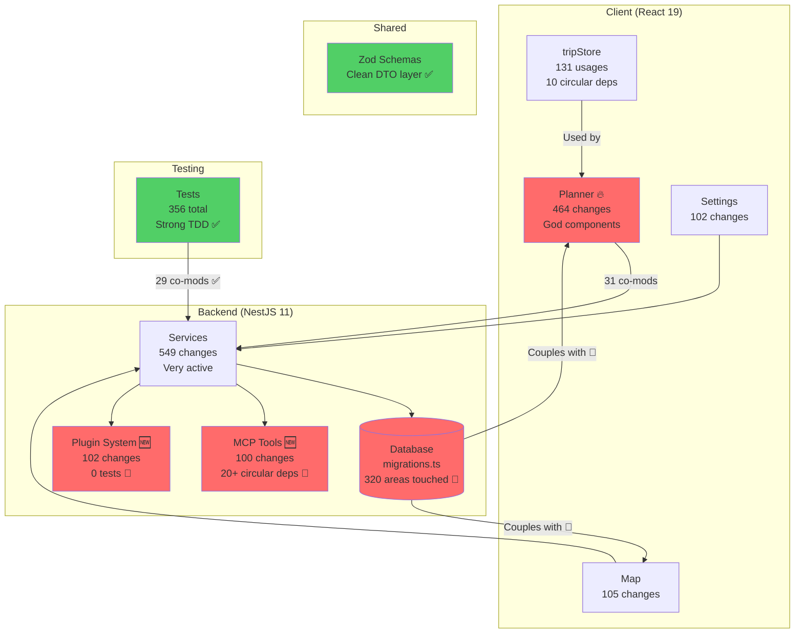

# Repository Map: TREK Travel Planner

> **For:** New developers joining the project  
> **Updated:** July 26, 2026  
> **Scope:** March–July 2026 (4.5 months of activity + dependency analysis)  
> **Sources:** Git history (1,338 commits), dependency-cruiser (6,254 modules), contributor analysis

---

## TL;DR (5 minutes)

**TREK** is a self-hosted travel planner (React 19 + NestJS 11) that evolved from MVP to platform in 4.5 months. The codebase is **young but mature** — excellent testing culture, clean layer boundaries, living documentation. Two core maintainers (Maurice + jubnl) control 91% of the work.

**Where things hurt:** The Planner (God components, 2,529 LOC files), database migrations touching 84% of the project, and brand-new areas (MCP tools, Plugins) with circular dependencies and zero tests.

**What's solid:** Client-server separation (perfect), test coverage in core services (TDD culture strong), NestJS migration executed cleanly (June 2026).

**Start here:** `client/src/pages/TripPlannerPage.tsx` (core user flow), `server/src/services/` (backend logic), `shared/src/schemas/` (API contracts).

---

## 1. Teren: Where Work Happens

**Source:** Git history, 1,338 commits, March–July 2026 (4.5 months).

| Area | Changes | Decision Impact |
|------|---------|-----------------|
| `client/src/components/Planner` | **464** (35%) | God components (2,529 LOC). Changes expensive. E2E test only. |
| `server/tests/unit/services` | **187** | TDD culture (29 co-mods with services). Strength. |
| `server/src/nest/plugins` | **102** 🆕 | **0 tests, 1 circular dep.** Platform pivot (July 2026). |
| `server/src/mcp/tools` | **100** 🆕 | **20+ circular deps, 0 tests.** AI layer (July 2026). |
| `client/src/components/Map` | **105** | Stable, testable (7/10). Low risk. |

**Timeline:** MVP sprint (Mar-Apr, 91% commits) → NestJS migration (Jun) → Platform shift (Jul).

**Catalog vs Reality:**
- `server/src/routes/` = Ghost (migrated May 31). Stale imports exist.
- `shared/` exists but bypassed — Frontend imports DB schemas directly.

---

## 2. Realne Powiązania: What Changes Together

### 2.1 Co-modification Coupling (Git History)

| Pair | Co-mods | Verdict |
|------|---------|---------|
| `services` ↔ `tests/unit` | **29** | ✅ TDD strength |
| `components` ↔ `pages` | **32** | ✅ Expected (composition) |
| `components` ↔ `services` | **31** | 🟡 Justified (2 files: photoService, weatherQueue = client cache) |
| **`components` ↔ `db/migrations`** | **17** | 🔴 **Frontend imports DB schemas directly** |
| **`pages` ↔ `db/migrations`** | **13** | 🔴 **No DTO layer** |
| **Planner ↔ `migrations`** | **14** | 🔴 **Tight coupling to DB shape** |

**Decision:** `migrations.ts` touches **320 areas (84% of project)**. Schema changes break everything. Introduce DTO layer (`shared/` has Zod, not enforced). Start with stable features (Settings), not volatile ones (Planner).

---

### 2.2 Import Graph (dependency-cruiser)

**Source:** 6,254 modules, 17,233 dependencies.

**Layer Boundaries: 0 violations** (Client ↔ Server ↔ Shared separation perfect).

**Circular Dependencies: 64 total**

| Area | Cycles | Pattern | Fix | Cost |
|------|--------|---------|-----|------|
| **MCP Tools** | **20+** | `tool → authService → mcp/index → tools` | DI refactor | 2-3 sprints |
| **tripStore + slices** | **10** | Bidirectional type imports | Accept (integration tests) OR type-only imports | 0 OR 2 sprints |
| **Notifications** | **4** | `channelRegistry ↔ preferences` | Strategy pattern | 1 sprint |
| **Plugins** | **1** | `rpc-host ↔ plugins.service` | Split God module | 2 sprints |

**Key insight:** Git showed 31 `components` ↔ `services` co-mods, but import graph = only 2 files (client cache). Git coupling ≠ import coupling.

---

**Unmapped:** Docker/CI (no import graph), Wiki/i18n (edit proximity only), query performance.

---

## 3. Strefy Ryzyka: High-Risk Areas

### 3.1 🔴 Planner God Components (Risk: 10/10)

**Evidence:** `DayPlanSidebar.tsx` (2,529 LOC), `TripPlannerPage.tsx` (813 LOC, 27 deps). #1 activity (464 changes). Touches 333 areas. E2E only (unit test = 500 LOC mock).

**Owner:** Maurice (53% Planner work).

**Decision:** E2E tests first (P0), then split (DayPlanHeader, DayPlanItem, DayPlanTransport). 3-4 sprints.

---

### 3.2 🔴 Database Coupling (Risk: 10/10)

**Evidence:** `migrations.ts` touches 320 areas (84%). Git: 17 co-mods (components), 13 (pages), 14 (Planner). Import graph: Frontend imports DB types directly, bypasses `shared/`.

**Owners:** Maurice (48% DB work) + jubnl (31%, security).

**Decision:** Gradual DTO migration. Start with Settings (stable), not Planner (volatile). Use existing `shared/` Zod schemas.

---

### 3.3 🔴 MCP Tools Circular Hell (Risk: 9/10)

**Evidence:** 20+ circular deps (import graph). Pattern: `tool → authService → mcp/index → tools`. 0 tests. New (July 2026).

**Owner:** jubnl (61% MCP work, designed it).

**Decision:** DI refactor (2-3 sprints). Inject authService instead of import. Fix NOW before marketplace grows.

---

### 3.4 🔴 Plugin System: Zero Tests (Risk: 9/10)

**Evidence:** `create-rpc-host.ts` (928 LOC, 31 deps, 40+ services). 0 tests. 1 circular dep. New (July 2026). Marketplace inferred.

**Owners:** Maurice + jubnl (joint).

**Decision:** Integration tests NOW (1-2 sprints) before marketplace. Real DB (:memory:), mock external APIs.

---

### 3.5 🟡 tripStore: Accept or Refactor? (Risk: 7/10)

**Evidence:** 10 circular deps (import graph). 131 usages (highest fan-in). Unit testing impossible. Runtime stable (Zustand OK).

**Owners:** Maurice (50%) + jubnl (43%).

**Decision needed:** (A) Accept + integration tests, OR (B) Refactor (type-only imports, 2 sprints).

---

### 3.6 🟢 Strengths

- **TDD culture:** 29 co-mods `services` ↔ `tests`. 356 tests. #1 strength.
- **Layer boundaries:** 0 violations (Client ↔ Server ↔ Shared).
- **NestJS migration:** Clean (June 2026), 48 modules, Strangler pattern.
- **Map:** Stable, testable (7/10), no circular deps.

---

## 4. Kogo Zapytać

**Core Maintainers (91% of work):**
- **Maurice** (mauriceboe@icloud.com, 424 commits): Planner, DB migrations, releases
- **jubnl** (jgunther021@gmail.com, 341 commits): MCP, OAuth, backend, security

**Major decisions require BOTH.** Schedule joint meetings for P0 (MCP, DTO, Planner).

**Niche Experts:**
- **MCP:** jubnl (61%) > Ivan (ivan@malinov.ski, 19%)
- **Database:** Maurice (48%) > jubnl (31%) > Marek (marek1.maslowski@gmail.com, 8%)
- **Planner:** Maurice (53%) > jubnl (20%)
- **Plugins:** Maurice + jubnl (joint)
- **Security:** jubnl, fgbona (fernando@fsecurity.com.br)
- **Search:** Ben Haas (ben@benhaas.io)
- **i18n:** Isaias Tavares

---

## 5. Pierwszy Dzień: Entry Points

Read in order (user flow → data → backend → risk zones):

1. **`client/src/pages/TripPlannerPage.tsx`** (813 LOC, 27 deps) — God component, core user flow. Shows how everything connects.

2. **`client/src/store/tripStore.ts`** (266 LOC, 131 usages) — Heart of state. 10 circular deps = integration tests only.

3. **`shared/src/schemas/tripSchemas.ts`** + `client/src/api/client.ts` (331 areas) — DTO layer (Zod). Critical infrastructure. Note: Frontend still imports DB types directly (coupling problem).

4. **`server/src/nest/trips/trips.service.ts`** — Business logic. NestJS 11, 48 modules, DI. Migrated June 2026.

5. **`server/src/db/migrations.ts`** (320 areas, 84% of project) — **DANGER.** Schema changes break everything. Discuss with Maurice + jubnl first.

6. **`server/tests/unit/services/`** (95 changes) — TDD culture (29 co-mods). 356 tests total. Gaps: MCP (0), Plugins (0).

7. **`server/src/mcp/tools/vacay.ts`** 🆕 — 20+ circular deps, 0 tests. AI layer. Don't add tools without DI refactor.

---

## 6. Ograniczenia

**Time Window:** March 18 – July 26, 2026 (4.5 months). Project is YOUNG. Patterns are short-term.

**Data Sources:**
- Git: 400/1,338 commits analyzed (filtered: package-lock, i18n, .snap)
- Import graph: dependency-cruiser, 6,254 modules, 17,233 deps
- Contributors: Human-only (bots filtered)

**NOT Mapped:** Performance, security audit, user metrics, deployment topology, i18n coupling.

**Coupling Types (source matters!):**
- **Git co-modification:** Edit proximity, NOT import dependency
- **Import graph:** Static imports (may include dead code)
- **Universal connectors:** High impact, doesn't prove WHICH areas couple

**Example:** `components` ↔ `services` = 31 Git co-mods BUT only 2 files in import graph (photoService, weatherQueue).

**Manual vs. Generated:**
- Migrations: Manual (expensive changes)
- Tests: TDD (good coupling)
- i18n: Manual (Isaias Tavares)
- API client: Hand-written (no Swagger)

---

**Decision Rules:**
1. Start with user flow (TripPlannerPage) → trace data (tripStore → services → DB)
2. Ask Maurice + jubnl for P0 decisions (they control 91%)
3. Trust tests (TDD real). No tests = high risk (MCP, Plugins)
4. Database changes = discuss first (84% coupling)
5. New != stable (MCP, Plugins = July 2026, 0 tests, circular deps)

---

*Map: March–July 2026 (4.5 months Git + dependency analysis). Patterns may shift as project matures.*
