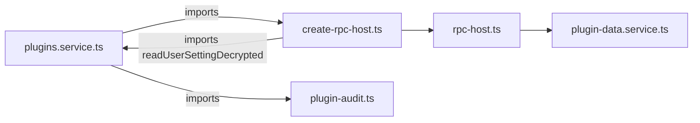
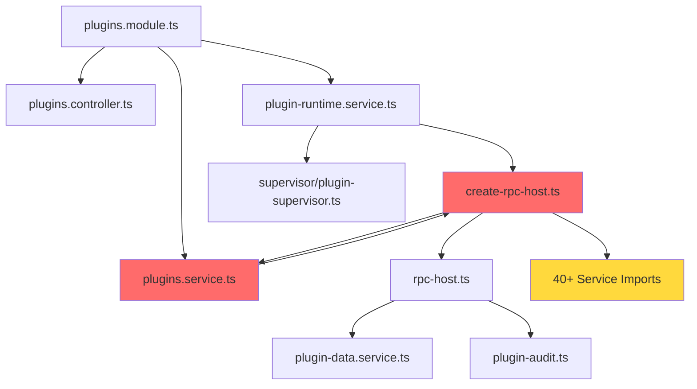
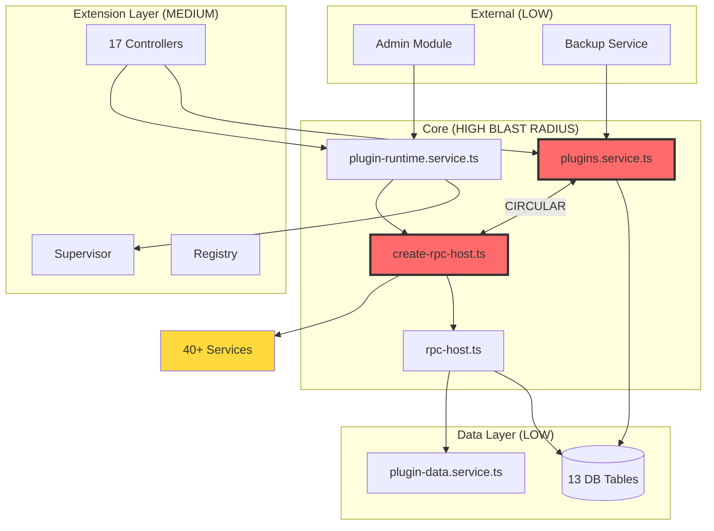

# Plugin System Blast Radius Analysis

**Analyzed**: 2026-07-26  
**System**: Plugin System (NEW - July 2026 "Platform pivot")  
**Commit History**: 102 changes since June 2026  
**Test Coverage**: 0 tests mentioned for overall Plugins

---

## Executive Summary

The Plugin System exhibits **HIGH change coupling** with 40+ service dependencies and a **critical circular dependency** in its core architecture. Changes to the plugin system require coordinated updates across multiple layers: database schema (13 tables), API surface (17 controllers), runtime isolation, and service integrations.

**Key Risk**: The circular dependency `plugins.service ↔ create-rpc-host` creates a fragile coupling that amplifies the blast radius of any change to either module.

---

## 1. The Circular Dependency

### Location: `plugins.service.ts ↔ create-rpc-host.ts`



**Evidence**:
- `create-rpc-host.ts:17` → `import { readUserSettingDecrypted } from '../plugins.service'`
- `plugins.service.ts:6` → `import { readAudit } from './host/plugin-audit'`
- `plugins.service.ts:8` → `import { pluginBudgetUsage } from './host/create-rpc-host'`

**Impact**: Any change to user settings schema in `plugins.service.ts` ripples through the RPC host layer, requiring both modules to be updated atomically.

---

## 2. Static Import Graph

### Core Module Dependencies



### The "God Module": `create-rpc-host.ts`

This file imports **40+ services** to wire plugin capabilities to the host system:

**Service Categories**:
- **Trip Services**: tripService, placeService, dayService, assignmentService
- **Budget/Costs**: budgetService, BudgetService
- **Reservations**: reservationsService, ReservationsService
- **Packing**: packingService
- **Files**: fileService
- **Addon Services**: 
  - journeyService (Journey addon)
  - atlasService (Atlas addon)
  - vacayService (Vacay addon)
  - collabService (Collab addon)
  - collectionsService (Collections addon)
- **Notifications**: notificationService
- **Auth/Permissions**: permissions, apiKeyCrypto
- **Database**: database.ts
- **Websocket**: websocket.ts

**Lines of Evidence**:
- `create-rpc-host.ts:1-42` - Dense import block
- `create-rpc-host.ts:209-928` - 720 lines of service delegation

---

## 3. External Import Surface

Files **outside** the `plugins/` directory that import from it:

### Admin Module
- `admin.controller.ts:4` → `PluginRuntimeService`
- `admin.module.ts:4` → `PluginsModule`

### Core Services
- `userCleanupService.ts:3` → `pluginsDataRoot`
- `backupService.ts:9-11` → plugin paths and backup functions

### Pattern
**Observation**: The plugin system is consumed by admin and infrastructure concerns, but rarely by core domain logic. This suggests plugins act as an **extension layer** rather than a core dependency.

---

## 4. Git Co-Change History

### Analysis Period: June 2026 - Present

**Top Co-Changed Files** (when plugin files changed):

| File Pattern | Changes | Type |
|-------------|---------|------|
| `package-lock.json` | 192 | Dependencies |
| `shared/src/i18n/fr/*.ts` | 96 each | Translations |
| Plugin tests | 1 each | Isolated |

**Key Insight**: Plugin changes do **NOT** frequently co-change with core domain logic. Most co-changes are infrastructure (package-lock, i18n, tests). This suggests plugins are well-isolated from business logic.

### Change Frequency by File (since June 2026):

```
plugins.service.ts                  1 change
plugin-runtime.service.ts           1 change
plugins.controller.ts               1 change
create-rpc-host.ts                  1 change
rpc-host.ts                         1 change
```

**Note**: Low change frequency suggests either:
1. The system is stable (good)
2. The system was just added and hasn't faced evolutionary pressure (risky)

---

## 5. Change Coupling by Layer

### A. Interface Seams (Must Stay Stable)

#### **REST API** (`/api/admin/plugins`, `/api/plugins/:id/*`)

**17 Controllers**:
1. `plugins.controller.ts` - Admin CRUD
2. `plugins-proxy.controller.ts` - Plugin HTTP routing
3. `plugins-feed.controller.ts` - Active plugin list for clients
4. `plugin-frame.controller.ts` - Sandboxed asset serving
5. `plugin-user-settings.controller.ts` - Per-user config
6. `plugin-oauth.controller.ts` - OAuth flows
7. `plugin-activity.controller.ts` - Activity widgets
8. `place-details.controller.ts` - Place detail providers
9. `trip-warnings.controller.ts` - Trip warning providers
10. `view-contributions.controller.ts` - View extensions
11. `trip-card-contributions.controller.ts` - Trip card widgets
12. `plugin-photos.controller.ts` - Photo integrations
13. `plugin-calendar.controller.ts` - Calendar integrations
14. `map-markers.controller.ts` - Map marker providers
15. `pdf-sections.controller.ts` - PDF generation hooks
16. `atlas-layers.controller.ts` - Atlas layer providers
17. `journal-entry-rows.controller.ts` - Journal extensions

**API Stability Contract**:
- Adding new controller = adding new capability slot
- Changing controller route = breaking frontend
- Changing request/response shape = breaking plugins

#### **RPC Protocol** (`protocol/envelope.ts`)

```typescript
export const KNOWN_METHODS: readonly string[] = [
  'db.query', 'db.exec', 'db.migrate', 'db.tx',
  'trips.getById', 'trips.getPlaces', 'trips.getDays',
  // ... 80+ more methods
];

export type RpcRequest = { k: 'req'; id: string; method: string; params?: unknown };
export type RpcResponse = { k: 'res'; id: string; ok: true; result: unknown };
export type RpcError = { k: 'res'; id: string; ok: false; error: { code: string; message: string } };
```

**Protocol Stability Contract**:
- Adding method = additive change (safe)
- Changing method signature = **BREAKING** for all plugins using it
- Changing error codes = breaking error handling

#### **Database Schema** (13 Plugin Tables)

Core tables:
1. `plugins` - Registry (metadata, permissions, status)
2. `plugin_settings_fields` - Settings schema
3. `plugin_user_config` - Per-user settings
4. `plugin_oauth_tokens` - OAuth state
5. `plugin_oauth_state` - OAuth flows
6. `plugin_capability_audit` - Permission usage log
7. `plugin_entity_metadata` - Plugin-attached metadata
8. `plugin_error_log` - Error history
9. `plugin_meta_migrations` - Plugin DB migrations
10. `plugin_scheduled_tasks` - Cron jobs
11. `plugin_user_erasure_queue` - GDPR erasure
12. `plugin_egress_hosts` - Operator-configured egress
13. `plugin_actions` - Settings page actions

**Schema Change Risks**:
- Adding column to `plugins` = safe if nullable
- Removing column = migration + potential data loss
- Changing `plugin_user_config` structure = requires coordinated update with `plugins.service.ts`

### B. Generated/Derived Layers (Auto-Updated)

When you add a new **capability grant** (e.g., `db:write:trips`):

1. **Update RPC Host** (`rpc-host.ts:294-1158`)
   - Add permission check: `if (has('db:write:trips'))`
   - Register method handler: `this.methods.set('trips.create', ...)`
   - Add authorization: `this.requireTripEdit(tripId, actor, deps.canEditTrip)`

2. **Update Type Definitions** (`protocol/envelope.ts`)
   - Add method to `KNOWN_METHODS` array
   - Update `KnownMethod` type

3. **Update Service Wiring** (`create-rpc-host.ts`)
   - Import required service
   - Wire service method in `HostDeps` interface
   - Delegate to service in dependency object (lines 209-928)

4. **Update Documentation**
   - Manifest schema (if new permission type)
   - Plugin SDK types

**Co-Change Cluster**: Adding capability = 4-file atomic change.

### C. Cross-Cutting Concerns

#### **Adding a New Controller** (Capability Slot)

Files that must change together:
1. Create controller file (`new-feature.controller.ts`)
2. Register in `plugins.module.ts:32` (controller array)
3. Define provider hook interface (if needed)
4. Update supervisor to recognize hook (`supervisor/plugin-supervisor.ts`)

**Example from codebase**:
- Adding `plugin-activity.controller.ts` required:
  - Module registration
  - Route `/api/plugins/:id/activity`
  - Hook provider interface

#### **Permission Schema Evolution**

When permission semantics change:
1. `rpc-host.ts` - Capability enforcement
2. `manifest.ts` - Schema validation
3. `plugins.service.ts` - Permission display
4. `plugin-runtime.service.ts` - Activation gates
5. Frontend - Permission consent UI

---

## 6. Interface Stability Boundaries

### **Stable Interfaces** (Rarely Change)

1. **Plugin Manifest Schema** (`trek-plugin.json`)
   - Breaking changes require migration path
   - Versioned via `manifestVersion` field

2. **RPC Method Signatures** 
   - Adding parameters = backward compatible (optional)
   - Removing parameters = **BREAKING**

3. **Database Schema** (Core tables)
   - Schema changes go through migrations
   - Plugin-owned tables (`plugin_data_<id>.db`) independent

### **Unstable Interfaces** (High Change Risk)

1. **Capability Grants** (adding new permissions)
   - Frequent evolution expected (system is new)
   - Requires 4-file co-change

2. **Service Wiring** (`create-rpc-host.ts`)
   - 40+ service dependencies
   - Any service signature change ripples here

3. **User Settings Schema**
   - Changes require coordinated update in `plugins.service.ts` and `create-rpc-host.ts`
   - Circular dependency amplifies risk

---

## 7. Migration Risks

### Database Schema Changes

**Scenario**: Add a new field to `plugins` table

**Affected Components**:
1. `migrations.ts` - SQL schema change
2. `plugins.service.ts` - TS type update
3. `plugin-runtime.service.ts` - Activation logic (if needed)
4. `plugins.controller.ts` - API response shape
5. Frontend - Type definitions

**Co-Change Pattern**: 5-file atomic update.

### RPC Protocol Evolution

**Scenario**: Add authentication to an existing RPC method

**Affected Components**:
1. `rpc-host.ts` - Add auth check
2. `protocol/envelope.ts` - Update types
3. Plugin SDK - Client-side types
4. All plugins using that method - Potentially **BREAKING**

**Migration Path Required**: Version the protocol or provide compatibility shim.

### Permission Model Changes

**Scenario**: Split `db:write:trips` into `trips:create` and `trips:update`

**Affected Components**:
1. Manifest schema validation
2. RPC host method registration
3. Activation consent logic
4. All existing plugins with `db:write:trips` grant
5. Migration to map old permission to new ones

**Migration Risk**: HIGH - affects every plugin with trip write access.

---

## 8. Change Together Clusters

### Cluster 1: **New Capability** (4 files)

```
protocol/envelope.ts (add method to KNOWN_METHODS)
rpc-host.ts (register handler + auth)
create-rpc-host.ts (wire service)
manifest.ts (update schema if new permission type)
```

### Cluster 2: **New Controller** (3 files)

```
new-feature.controller.ts (create)
plugins.module.ts (register)
supervisor/plugin-supervisor.ts (if provider hook)
```

### Cluster 3: **Settings Schema** (2 files, **CIRCULAR**)

```
plugins.service.ts (schema + CRUD)
create-rpc-host.ts (RPC host access)
```

### Cluster 4: **Database Migration** (5+ files)

```
migrations.ts (SQL)
plugins.service.ts (type)
plugin-runtime.service.ts (logic)
plugins.controller.ts (API)
Frontend types
```

---

## 9. Blast Radius Visualization



**Legend**:
- **Red (HIGH)**: Core modules, circular dependency
- **Yellow (MEDIUM)**: Extension points, many dependents
- **Gray (LOW)**: Data, external consumers

---

## 10. Recommendations

### **Immediate (Break Circular Dependency)**

1. **Extract Settings Access Interface**
   - Create `plugin-settings.interface.ts`
   - Move `readUserSettingDecrypted` to new file
   - Break `plugins.service ↔ create-rpc-host` cycle

2. **Dependency Injection for Service Access**
   - Instead of importing 40+ services directly in `create-rpc-host.ts`
   - Inject via `HostDeps` interface
   - Makes testing easier, reduces coupling

### **Short-Term (Reduce God Module)**

3. **Split `create-rpc-host.ts`**
   - Extract service categories into separate wiring modules:
     - `wiring/trip-capabilities.ts`
     - `wiring/addon-capabilities.ts`
     - `wiring/notification-capabilities.ts`
   - Compose into single `HostDeps` object

4. **Interface Stability Documentation**
   - Document breaking vs. non-breaking changes for:
     - RPC protocol
     - Database schema
     - Permission model
   - Add changelog discipline

### **Long-Term (Evolutionary Architecture)**

5. **Capability Versioning**
   - Allow plugins to target specific capability versions
   - Maintain backward compatibility shims
   - Deprecate old capabilities gradually

6. **Integration Testing**
   - **0 tests** for plugins is HIGH RISK
   - Add integration tests for:
     - RPC protocol
     - Permission enforcement
     - Settings isolation
     - Database migrations

---

## Appendix: File References

### Circular Dependency Lines
- `plugins.service.ts:6` → `import { readAudit } from './host/plugin-audit'`
- `plugins.service.ts:8` → `import { pluginBudgetUsage } from './host/create-rpc-host'`
- `create-rpc-host.ts:17` → `import { readUserSettingDecrypted } from '../plugins.service'`

### God Module Service Imports
- `create-rpc-host.ts:1-42` - 40+ service imports
- `create-rpc-host.ts:209-928` - 720 lines of service delegation

### RPC Protocol Surface
- `rpc-host.ts:286-1158` - Method registration (873 lines)
- `protocol/envelope.ts:15-20` - KNOWN_METHODS array

### Database Tables
- `migrations.ts:3299-3618` - 13 plugin-related CREATE TABLE statements
