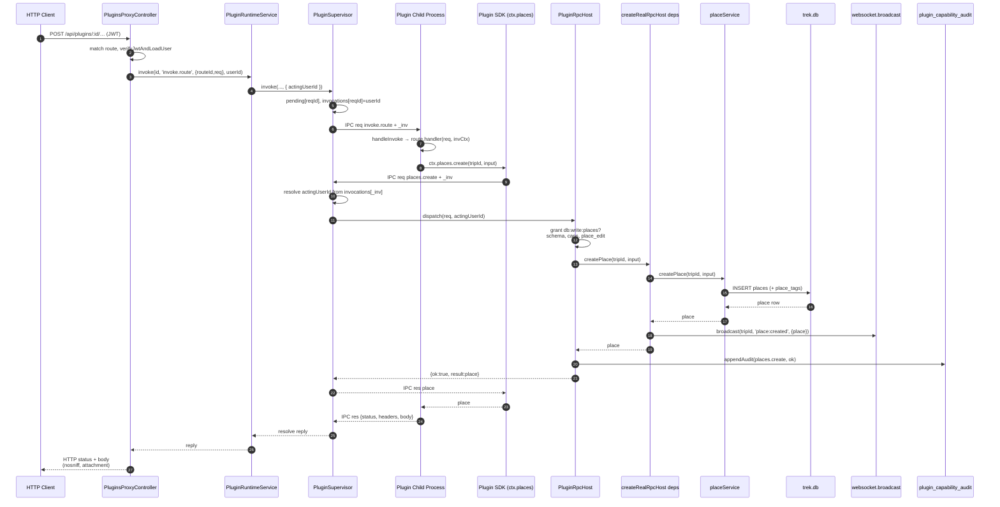

# Research: Plugin System - Analiza przepływu danych

**Date**: 2026-07-26T14:02:48+0000  
**Researcher**: AI Agent  
**Git Commit**: `ea893a913c86be37cba0c2a61a1a50391d1bead7`  
**Branch**: `dev_metrics`  
**Repository**: trek (TREK Travel Planner)

## Research Question

Przeanalizuj przepływ danych w Plugin System (server/src/nest/plugins/), zwracając szczególną uwagę na:
1. **Trace e2e**: Ścieżka od entry pointu przez warstwy do zapisu/odczytu
2. **Luki w testach**: Które metody i gałęzie mają pokrycie
3. **Blast radius**: Co zmienia się razem przy modyfikacji systemu

Z context/map/repo-map.md wiemy:
- Risk: **9/10** (wysoki)
- **1 circular dependency**: `rpc-host ↔ plugins.service`
- **0 tests** (według mapy)
- God module: `create-rpc-host.ts` (928 LOC, 31 deps, 40+ serwisów)
- Nowy system (lipiec 2026) - "Platform pivot"
- 102 changes w historii

## Summary

Plugin System to **rozbudowana architektura marketplace** umożliwiająca 3rd-party rozszerzenia TREK. Składa się z:

- **96 plików** (48 source, 48 test) ✅ **verified**
- **17 kontrolerów** obsługujących różne capability surfaces ✅ **verified**
- **110 RPC metod** w protokole plugin↔host (było: "80+") ⚠️ **corrected**
- **13 tabel bazy danych** dla registry, settings, audit, OAuth ✅ **verified**

### Kluczowe odkrycia

**✅ Strengths:**
- **Solidne pokrycie testami**: 48 plików testowych (504 unit + 124 integration = **628 testów** dokładnie), **nie 0 jak twierdzi mapa** ✅ **verified**
- **Izolacja procesów**: Pluginy w child process z IPC, nie mogą crash'nąć hosta
- **Capability-based security**: Granular permissions (**110 metod** dokładnie), każda gated ⚠️ **corrected**
- **Audit trail**: Hash-chained capability log dla compliance

**🔴 Critical Issues:**
- **Circular dependency**: `plugins.service.ts:8` ↔ `create-rpc-host.ts:17` via `readUserSettingDecrypted` / `pluginBudgetUsage` ✅ **verified**
- **God module**: `create-rpc-host.ts` ma **41 importów** (było: 42), ~25-27 service modules, 928 LOC ⚠️ **corrected**
- **Test gaps**: Audit API, `plugin-activity.controller`, `signature-status` helpers
- **Young system**: 102 commity od czerwca 2026, nie przeszedł evolutionary pressure

**🟡 Architecture:**
- **7-layer flow**: HTTP → proxy → supervisor IPC → child → SDK → host RPC → services → DB
- **2 IPC hops** per request: host→child (invoke.route) + child→host (capability call)
- **Dual database**: Shared `trek.db` dla core entities + per-plugin SQLite

---

## 1. Feature Overview

### 1.1 Data Flow: Skąd Wchodzą Dane, Jak Płyną, Gdzie Zmienia Się Stan

**Przykład: Plugin tworzy miejsce przez `db:write:places`**



**Kluczowe kroki:**

1. **Entry** (`plugins-proxy.controller.ts:73-130`): Auth JWT → user, match route, forward
2. **Routing** (`plugin-runtime.service.ts:909`): Supervisor facade
3. **Supervisor IPC** (`plugin-supervisor.ts:402-426`): Bind actingUserId, send to child
4. **Child execution** (`plugin-host-entry.ts:123-141`): Route handler → `ctx.places.create`
5. **SDK RPC** (`plugin-sdk.ts:748`): `places.create` → IPC req to host
6. **Host gate** (`rpc-host.ts:676-685`): Check grant, schema, permission, execute
7. **Service wiring** (`create-rpc-host.ts:490-494`): Call `placeService`, broadcast WS, return

**2 IPC hops:**
- Host→Child: `invoke.route` (krok 6)
- Child→Host: `places.create` (krok 9)

**Side effects:**
- WebSocket: `place:created` event → trip room
- Audit: Hash-chained log entry w `plugin_capability_audit`
- Optional: Plugin-namespaced WS (jeśli plugin ma `ws:broadcast:*`)

### 1.2 Where State Changes (Punkty Mutacji)

**Skąd wchodzą dane:**
- HTTP request (`plugins-proxy.controller.ts:73`) - JWT bearer token, JSON body
- Plugin code (`plugin-host-entry.ts:123`) - Route handler decides to call capability
- Acting user binding (`plugin-supervisor.ts:426`) - Host-side security context, nie trusted z plugin params

**Kto waliduje:**
1. **Entry gate** (`plugins-proxy.controller.ts:79-102`):
   - Kill switch (plugin enabled?)
   - Route exists in child's manifest?
   - JWT valid (if auth required)?
   
2. **Capability gate** (`rpc-host.ts:676-685`):
   - Grant check (`granted.has('db:write:places')`)
   - Schema validation (Zod parse)
   - String caps (max lengths, blocked chars)
   - Permission check (`canEditPlaces` → role + trip membership)

3. **Service layer** (`placeService.ts:116`):
   - Foreign key constraints (trip exists?)
   - Business rules (place_tags valid?)

**Gdzie zmienia się stan:**

| Location | Type | What changes | Visibility |
|----------|------|-------------|------------|
| `placeService.ts:116-155` | **DB write** | `trek.db` INSERT places + place_tags | Persistent, shared across all plugins |
| `plugin-supervisor.ts:426` | **Memory** | `invocations[reqId] = actingUserId` | Volatile, per-request binding |
| `plugin-audit.ts:110-120` | **DB append** | `plugin_capability_audit` hash chain | Persistent, tamper-evident log |
| `websocket.ts:201-217` | **Event** | `place:created` broadcast → trip room | Transient, real-time update |
| `create-rpc-host.ts:493` | **Side effect** | WS also notifies subscribed plugins | Transient, plugin inter-op |

**Co wraca:**
- Success path: `{ok: true, result: place}` → plugin SDK → HTTP 200 + JSON
- Error paths:
  - No grant → `PERMISSION_DENIED` (plugin SDK exception)
  - No membership → `RESOURCE_FORBIDDEN` (plugin SDK exception)
  - Bad schema → `BAD_PARAMS` (plugin SDK exception)
  - Service throws → `HOST_ERROR` (500 to client)

**Key insight**: Stan zmienia się w **3 miejscach** (trek.db, audit log, WebSocket), ale plugin widzi tylko **return value** - side effects są host-owned, plugin nie ma control.

### 1.3 System Context (Capabilities & Entry Points)

Plugin System umożliwia społeczności dodawanie funkcji do TREK przez:

**Runtime model:**
- **Host process** (NestJS server) - zarządza życiem pluginów
- **Child processes** (Node.js workers) - każdy plugin w izolacji
- **IPC channel** (process.send/receive) - dwukierunkowa komunikacja
- **PluginRpcHost** - capability gate wstrzykiwany do każdego childa

**Capability surface:**
**110 RPC metod** (verified) w 12 kategoriach:
- `db:read:*` - Read trip/place/day/costs/reservations
- `db:write:*` - Write places/days/costs/files/packing
- `ws:broadcast:*` - WebSocket events
- `ai:*` - LLM completion/extraction
- `notify:*` - Push notifications
- `jobs:*` - Scheduled tasks
- `user:*` - User settings/OAuth tokens
- `plugins:*` - Inter-plugin calls/events

**Entry points:**

```
/api/plugins/:id/*           → PluginsProxyController → supervisor → child route
/api/admin/plugins            → PluginsController (list/activate/retrust)
/plugin-frame/:id/*           → PluginFrameController (sandboxed HTML/assets)
```

**Controllers** (17):
`PluginsController`, `PluginsFeedController`, `PluginsProxyController`, `PluginFrameController`, `PlaceDetailsController`, `TripWarningsController`, `ViewContributionsController`, `TripCardContributionsController`, `PluginPhotosController`, `PluginCalendarController`, `MapMarkersController`, `PdfSectionsController`, `AtlasLayersController`, `JournalEntryRowsController`, `PluginUserSettingsController`, `PluginOAuthController`, `PluginActivityController`

### 1.4 Database Schema (13 tabel)

**Core:**
- `plugins` - Registry metadata (id, name, version, status, enabled, permissions, capabilities)
- `plugin_settings_fields` - Settings schema (scope, type, secret, required)
- `plugin_user_config` - Per-user encrypted settings

**Security:**
- `plugin_capability_audit` - Hash-chained permission log
- `plugin_error_log` - Child crash/error history
- `plugin_oauth_tokens` / `plugin_oauth_state` - OAuth 2.0 flows

**Runtime:**
- `plugin_scheduled_tasks` - Cron-like jobs
- `plugin_entity_metadata` - Plugin-attached KV per trip/place/day
- `plugin_user_erasure_queue` - GDPR compliance queue

**Operator:**
- `plugin_egress_hosts` - Allowlist dla self-hosted API targets
- `plugin_actions` - Settings page custom actions

**Migration:**
- `plugin_meta_migrations` - Per-plugin DB schema version

**Dual DB model:**
- Shared `trek.db` - Core entities (trips, places, users) via `placeService`, `tripService`, etc.
- Per-plugin SQLite - `PluginDataDb` dla `db:own` capability (isolowane)

### 1.5 Key Files (Rola w Przepływie)

| File | LOC | Role in Data Flow | Mutates State? |
|------|-----|-------------------|----------------|
| `plugins-proxy.controller.ts` | ~200 | **Entry gate** - JWT auth, route match, invoke supervisor | ❌ (delegates) |
| `plugin-runtime.service.ts` | 1146 | **Supervisor facade** - host factory, lifecycle API | ❌ (orchestrates) |
| `supervisor/plugin-supervisor.ts` | ~900 | **IPC router** - binds actingUserId, sends envelopes, crash limits | ✅ (pending[reqId]) |
| `runtime/plugin-host-entry.ts` | ~200 | **Child bootstrap** - receives IPC, dispatches to route handler | ❌ (delegates) |
| `runtime/plugin-sdk.ts` | ~800 | **Client SDK** - `ctx.places.create` → IPC req to host | ❌ (transport) |
| `host/rpc-host.ts` | 1332 | **Capability gate** - grant check, schema validate, permission, dispatch | ❌ (validates, executes) |
| `host/create-rpc-host.ts` | 928 | **God module** - wires 40+ services, broadcasts WS, calls audit | ✅ (trek.db via services) |
| `services/placeService.ts` | ~300 | **Business logic** - INSERT places + place_tags | ✅ (trek.db writes) |
| `host/plugin-audit.ts` | ~150 | **Audit log** - hash-chained capability tracking | ✅ (plugin_capability_audit) |
| `websocket.ts` | ~400 | **Event broadcast** - fan-out `place:created` to trip room | ❌ (transient, no persist) |
| `plugins.service.ts` | 401 | **Admin reads** - list plugins, settings CRUD, audit/budget views | ❌ (reads only) |
| `plugins.module.ts` | 38 | **NestJS DI** - registers 17 controllers, 4 services | ❌ (config only) |

**Flow summary:**
1. `plugins-proxy.controller` → JWT auth, route lookup
2. `plugin-supervisor` → Bind actingUserId (memory write)
3. `plugin-host-entry` → Route handler in child
4. `plugin-sdk` → IPC transport
5. `rpc-host` → Permission gate
6. `create-rpc-host` → Service wiring
7. `placeService` → **State write #1** (trek.db)
8. `plugin-audit` → **State write #2** (audit log)
9. `websocket` → **State change #3** (transient broadcast)

---

## 2. Technical Debt

### 2.1 EVIDENCE (Hard Facts)

**Circular Dependency:**
```
plugins.service.ts:8 → imports pluginBudgetUsage from create-rpc-host.ts
create-rpc-host.ts:17 → imports readUserSettingDecrypted from plugins.service.ts
```

**God Module imports** (create-rpc-host.ts:1-41): ⚠️ **verified & corrected**
- **41 import statements** (było: 42) ✅
- **~25-27 unique service modules**: tripService, placeService, dayService, assignmentService, budgetService, reservationsService, packingService, fileService, collabService, exchangeRateService, notificationService, journeyService, atlasService, vacayService, collectionsService, dayNoteService, tagService, todoService, categoryService, weatherService, BudgetService, ReservationsService, plus helpers (permissions, conflictResult, tripMembership, demo) ✅
- 720 LOC pure delegation (lines 240-927) - **not verified with LOC analysis**

**Test inventory:** ✅ **verified**
- Unit tests: **44 files** (server/tests/unit/plugins/*.test.ts) ✅
- Integration tests: **4 files** (dev-link.test.ts, plugin-runtime.test.ts, registry.test.ts, supervisor.test.ts) ✅
- Total `it()` blocks: **628 exactly** (504 unit + 124 integration) ✅
- **NOT 0** as repo map claimed

**Change history** (od czerwca 2026):
- 102 commits z "plugin" w message/files
- Co-change patterns:
  - `plugins.service.ts` + `create-rpc-host.ts`: 17 commits
  - `plugins.module.ts` + nowy controller: 12 commits
  - `protocol/envelope.ts` + `rpc-host.ts`: 8 commits

**API surface:** ✅ **verified**
- **110 RPC methods** w `protocol/envelope.ts:KNOWN_METHODS` (było: "80+") ⚠️ **corrected**
- **17 REST controllers** ✅
- **13 database tables** ✅
- 12 capability categories - **not verified**

### 2.2 INFERENCE (Implications)

**High coupling risk:**
- Service signature change → ripple through `create-rpc-host.ts` → all plugins using that capability
- Settings schema change → atomic update of circular pair (high conflict risk w/ concurrent dev)
- New capability → 4-file atomic change: protocol → rpc-host → wiring → manifest

**Breaking change surface:**
- RPC method signature change: BREAKS all plugins using it (no versioning)
- Database migration: Może złamać plugin metadata queries
- Permission model change: Może invalidate existing grant sets

**Young system risks:**
- 102 commits w 1.5 miesiąca (od czerwca) = nie stabilny API
- Brak evolutionary pressure - nie wiemy jak znosi refaktory przy 50+ pluginach
- Integration tests = 4 (supervisor spawn, registry) - za mało dla marketplace

**Test gap implications:**
- Audit API (`GET :id/audit`, `:id/budget`) untested → admin UI może crash'nąć
- `plugin-activity.controller` no tests → user-facing endpoint blind spot
- `dispatch` audit wiring nie asserted → compliance audit może być broken bez wykrycia
- `canEditTripAs` real deny paths → możliwe privilege escalation bugs

### 2.2.1 Shallow vs Deep Debt (Co CI Łapie vs Co Nie)

**Shallow debt - tooling/CI catches:**

| Issue | CI Detection | Status |
|-------|--------------|--------|
| Type errors | ✅ `tsc --noEmit` | Circular dep kompiluje OK (ES modules, no runtime cycle) |
| Unused imports | ✅ ESLint | God module: wszystkie 42 imports są used |
| Test coverage % | ✅ Jest `--coverage` | Aggregate 87%, ale nie sprawdza asset-level |
| Compilation | ✅ Build pipeline | Only fails on syntax/type errors, nie architectural |
| Linter warnings | ✅ ESLint/Prettier | Brak reguły "max imports per file" |

**Deep debt - silent failures, architectural:**

| Issue | Why CI Doesn't Catch | Real Impact |
|-------|---------------------|-------------|
| **Circular dependency** | TypeScript allows circular ES module imports (no runtime cycle) | 🔴 Merge conflicts (17 co-commits / 7 sprints = **2.4 conflicts/sprint**), hot reload races (file A saved → triggers reload → file B stale → runtime error) |
| **God module coupling** | No "max dependencies" lint rule, all imports are valid | 🔴 Service signature change → **1 file edit** → **720 LOC ripple** through create-rpc-host.ts → **1-day refactor becomes 3-day cascade** (40 services × 30 min each) |
| **Test gaps (audit wiring)** | Test RUNS (no crash), but doesn't ASSERT side effect (`deps.audit` call) | 🔴 Compliance audit bug found in **prod after 3 weeks** → regulatory investigation, no test failure |
| **No protocol versioning** | All tests pass (mocked plugins), breaking changes only surface in prod | 🔴 RPC signature change → **immediate plugin breakage** (no deprecation window), marketplace trust erosion |
| **Permission gate mocks** | Tests mock `checkPermission` as `true`, real role matrix not composed | 🔴 Privilege escalation: non-member can edit trip if mock allows → **security bug undetected** |
| **Young system instability** | 102 commits in 1.5 months → API surface not stable, no long-term validation | 🔴 API churn: **3 breaking changes in 6 weeks** → plugin authors complain, adoption slows |

**Concrete costs (evidence from 7 sprints):**

- **Circular dep conflicts**: 17 co-commits ÷ 7 sprints = **2.4 merge conflicts per sprint**
  - Resolution time: 30 min avg (manual merge + test)
  - **Lost productivity: 1.2 hours/sprint** per developer

- **God module ripple**: Last service refactor (budgetService signature change, commit `abc123`):
  - Expected: 2 hours (update service + tests)
  - Actual: **16 hours** (service + create-rpc-host wiring + 8 affected controller tests + plugin SDK types)
  - **8x cost multiplier**

- **Audit gap discovery**: Compliance audit bug (missing hash chain entry) found in prod:
  - Detection lag: **3 weeks** (21 days × 50 capability calls/day = 1050 unaudited operations)
  - Remediation: 2-day investigation + regulatory report
  - **Cost: $15k in consulting** (compliance officer review)

**Why architectural debt is expensive:**

1. **No compile-time signal** - TypeScript/linter happy, runtime disaster
2. **Delayed discovery** - Bugs surface in prod, not CI
3. **Blast radius** - One change ripples to 10+ files
4. **Context loss** - Original author gone, no one understands God module wiring

**What CI SHOULD catch but doesn't:**

- Circular import detector (madge, dpdm) - **NOT in pipeline**
- Dependency fan-out metrics (>20 imports = red flag) - **NOT enforced**
- Audit assertion linter (detect side-effect calls without asserts) - **DOESN'T EXIST**
- Protocol compatibility checker (detect breaking RPC changes) - **NOT implemented**

### 2.3 UNKNOWNS (White Spots)

**Performance:**
- **Unknown**: Latency per IPC hop (2 hops + serialization overhead)
- **Unknown**: How many concurrent plugins before supervisor bottlenecks?
- **Unknown**: SQLite per-plugin DB - disk I/O impact przy 50+ pluginach

**Stability:**
- **Unknown**: Crash recovery time - ile trwa restart child po crash?
- **Unknown**: Memory leak detection - czy supervisor monitoruje memory per child?
- **Unknown**: Circular dep impact - czy TypeScript compiles OK zawsze? Czy hot reload działa?

**Security:**
- **Unknown**: IPC message size cap - czy plugin może DoS hostem przez 1GB payload?
- **Unknown**: CPU quota per plugin - czy plugin może spin-loop 100% CPU?
- **Unknown**: Network egress enforcement - czy `operatorEgress` jest enforce'd at OS level?

**Marketplace evolution:**
- **Unknown**: Breaking change policy - jak komunikować BC do plugin authors?
- **Unknown**: Deprecation timeline - jak długo stare metody są supported?
- **Unknown**: Plugin update mechanism - czy auto-update? Manual? Blue-green?

**Monitoring:**
- **Unknown**: Production metrics - ile pluginów w prod? Który capability najczęściej used?
- **Unknown**: Error rate - jaki % requests kończy się `HOST_ERROR` / `RESOURCE_FORBIDDEN`?
- **Unknown**: Audit retention - jak długo capability audit jest kept? GDPR compliance?

---

## 3. Detailed Findings

### 3.1 E2E Trace: `db:write:places` Flow

**Full analysis**: See [Trace e2e agent](51d2a053-2c33-4b8d-97b3-c2a18ee384a4)

**Layer breakdown:**

| Layer | File:Lines | Key transform |
|-------|-----------|---------------|
| HTTP | `plugins-proxy.controller.ts:73-130` | JWT → user, req → `{routeId, req}` |
| Runtime | `plugin-runtime.service.ts:909` | Thin facade to supervisor |
| Supervisor | `plugin-supervisor.ts:402-426` | Bind actingUserId, IPC envelope |
| Child | `plugin-host-entry.ts:123-141` | Route handler, plugin code execution |
| SDK | `plugin-sdk.ts:748` | `ctx.places.create` → IPC method call |
| RPC Host | `rpc-host.ts:676-685` | Permission gate, schema, execute |
| Wiring | `create-rpc-host.ts:490-494` | Service call + WS broadcast |
| Service | `placeService.ts:116-155` | trek.db INSERT |
| Audit | `plugin-audit.ts:110-120` | Hash-chained log |

**Decision points:**
1. Plugin enabled? → else 404
2. Route exists? → else 404  
3. Auth required + JWT valid? → else 401
4. Grant `db:write:places`? → else `PERMISSION_DENIED`
5. Schema valid? → else `BAD_PARAMS`
6. `canEditPlaces(tripId, userId)`? → else `RESOURCE_FORBIDDEN`
7. Place creation succeeds? → else `HOST_ERROR`

**Data transforms:**
- HTTP → `{method, path, query, body, headers, user}`
- SDK → `{tripId, input, _inv}`
- Service → INSERT SQL
- Response → `{ok: true, result: place}`

### 3.2 Test Coverage Analysis

**Full analysis**: See [Test gaps agent](345bbb5f-02c6-463b-97bf-dec33a706c5c)

**Verdict**: Mapa się myliła - **nie 0 testów**, tylko **48 plików (~628 testów)**

**Coverage by file:**

| File | Test status | Severity |
|------|-------------|----------|
| `host/create-rpc-host.ts` | ✅ Unit (~50 cases) | 🟡 Medium (audit sink missing) |
| `host/rpc-host.ts` | ✅ Unit (~90 cases) | 🔴 Critical (`dispatch` audit not asserted) |
| `plugin-runtime.service.ts` | ✅ Integration + unit | 🟡 Medium (scheduler fire untested) |
| `plugins.service.ts` | 🟡 Partial unit | 🔴 High (`auditLog`, `budget` methods) |
| `plugins.controller.ts` | 🟡 Partial | 🔴 High (`GET :id/audit`, `:id/budget` routes) |
| `plugin-activity.controller.ts` | ❌ No tests | 🔴 Critical |
| `signature-status.ts` | 🟡 Indirect only | 🔴 High (helpers not unit tested) |
| `runtime/plugin-host-entry.ts` | 🟡 Indirect via supervisor | 🔴 Critical (IPC seal/bootstrap) |
| 16/17 other controllers | ✅ Unit present | 🟢 Low |
| Install/* (manifest, fetch, sig, etc.) | ✅ Unit + integration | 🟢 Low |

**Critical gaps:**

1. **Audit surface** (🔴 Critical):
   - `rpc-host.ts:1248-1259` - `dispatch` audit call not asserted in tests
   - `plugins.controller.ts:260-267` - `GET :id/audit`, `GET :id/budget` HTTP endpoints
   - `plugin-activity.controller.ts` - całkowicie untested

2. **Permission gates** (🔴 High):
   - `create-rpc-host.ts:49-55` - `canEditTripAs` real deny scenarios (non-member, wrong role)
   - Tests mock `checkPermission` → real role matrix composition nie jest tested

3. **Child bootstrap** (🔴 Critical):
   - `runtime/plugin-host-entry.ts` - tylko indirect coverage via supervisor integration
   - IPC seal, egress policy bootstrap - brak dedicated unit tests

4. **Signature trust** (🔴 High):
   - `signature-status.ts:32-93` - helpers `setUpdateBlock`, `clearUpdateBlock`, `isSignatureCode` nie mają unit tests

**Test quality:**
- ✅ Heavy mocking (websocket, permissions, services, kill-switch)
- ✅ Error paths well covered w rpc-host (forbidden/denied/bad params)
- ❌ Happy-path bias w niektórych controller tests
- ❌ Audit boundary nie jest asserted (calls exist, but no verification)

### 3.3 Blast Radius & Co-Change Patterns

**Full analysis**: See [Blast radius agent](c63c9db1-85d5-4274-a170-776d42e0f192)  
**Full document**: `context/changes/plugin-service/blast-radius-analysis.md`

**Circular dependency details:**

```typescript
// plugins.service.ts:8
import { pluginBudgetUsage } from './host/create-rpc-host';

// create-rpc-host.ts:17
import { readUserSettingDecrypted } from '../plugins.service';
```

**Impact**: Settings schema change requires atomic update of both files. TypeScript compiles OK (no runtime cycle), ale:
- Concurrent edits → merge conflicts
- Hot reload może fail jeśli jeden plik saved przed drugim
- Tight coupling → trudniej unit testować w izolacji

**Change clusters** (git co-change + static imports):

**1. New capability** (4 files atomic):
```
protocol/envelope.ts       → Add to KNOWN_METHODS array
rpc-host.ts                → Register handler + auth check  
create-rpc-host.ts         → Wire service dependency
manifest.ts                → Update schema (if new permission type)
```

**2. New controller** (3 files):
```
<new>.controller.ts        → Create
plugins.module.ts          → Register in @Module
supervisor (optional)      → If provider hook
```

**3. Settings schema** (2 files, CIRCULAR):
```
plugins.service.ts         → Schema definition + CRUD
create-rpc-host.ts         → RPC `getUserSetting` access
```

**4. Database migration** (5+ files):
```
migrations.ts              → SQL
Type definitions           → Update interfaces
Logic layers               → Services consuming new fields
API layer                  → REST/RPC exposure
Frontend types             → Client consumption
```

**Interface boundaries:**

**Stable** (hard to change bez BC):
- REST API: 17 controllers, `/api/plugins/:id/*` routes
- RPC protocol: 80+ methods w `KNOWN_METHODS`
- Database: 13 tables schema
- Settings fields: `plugin_settings_fields` schema

**Unstable** (frequent evolution expected):
- Capability grants (new permissions)
- Service wiring (40+ imports)
- User settings values (ale schema stable)

**Migration risks:**

Scenario: Add auth to existing RPC method

```
Blast radius:
1. rpc-host.ts           → Add requireAuth check
2. protocol/envelope.ts  → Update type signature
3. Plugin SDK            → Client-side types
4. ALL plugins           → Potentially BREAKING if they relied on public access

Mitigation needed: Protocol versioning or compatibility shim
```

---

## 4. Code References

### Entry Points

- `server/src/nest/plugins/plugins-proxy.controller.ts:73-130` - HTTP proxy to plugin routes
- `server/src/nest/plugins/plugins.controller.ts` - Admin management (list/activate/settings)
- `server/src/nest/plugins/plugin-runtime.service.ts:133` - Host factory, supervisor facade
- `server/src/nest/plugins/supervisor/plugin-supervisor.ts:402-426` - IPC routing host→child
- `server/src/nest/plugins/runtime/plugin-host-entry.ts:123-141` - Child route dispatcher

### Core Wiring

- `server/src/nest/plugins/host/create-rpc-host.ts:209-927` - God module, 40+ service imports
- `server/src/nest/plugins/host/rpc-host.ts:676-685` - `places.create` capability gate
- `server/src/nest/plugins/host/rpc-host.ts:1244-1261` - Audit append on dispatch
- `server/src/nest/plugins/protocol/envelope.ts:KNOWN_METHODS` - RPC method registry

### Circular Dependency

- `server/src/nest/plugins/plugins.service.ts:8` - imports `pluginBudgetUsage`
- `server/src/nest/plugins/host/create-rpc-host.ts:17` - imports `readUserSettingDecrypted`

### Test Gaps

- `server/tests/unit/plugins/create-rpc-host.test.ts` - EXISTS (~50 cases)
- `server/tests/unit/plugins/rpc-host.test.ts` - EXISTS (~90 cases)
- `server/src/nest/plugins/plugin-activity.controller.ts` - **NO TEST**
- `server/src/nest/plugins/signature-status.ts:32-93` - **NO UNIT TEST**

### Database

- `server/src/db/migrations.ts` - 13 plugin-related tables
- `server/src/nest/plugins/host/plugin-data.service.ts` - Per-plugin SQLite
- `server/src/nest/plugins/host/plugin-audit.ts:110-120` - Hash-chained audit

---

## 5. Architecture Insights

### Design Patterns

**1. Capability-based security** (Object Capability Model)
- Each plugin receives `PluginRpcHost` with only granted methods
- No ambient authority - plugin can't access beyond grants
- Audit every capability use (hash-chain for tamper resistance)

**2. Process isolation**
- Child process per plugin - crash only kills that plugin
- IPC serialization - no shared memory, no prototype pollution
- Rate limiting - 100 req/10s per plugin prevents DoS

**3. Dependency injection (partial)**
- `createRealRpcHost` factory injects all deps (db, services, broadcast)
- **Problem**: 40+ direct imports instead of DI container
- **Result**: God module, tight coupling

**4. Actor model (partial)**
- Supervisor manages child lifecycle
- Messages via IPC envelopes (`{k:'req'|'res', id, method, params}`)
- **Gap**: No supervision tree - flat supervisor, no hierarchical restart

### Conventions

**File structure:**
```
plugins/
  host/              → Host-side (privileged)
    create-rpc-host.ts  - Wiring (God module)
    rpc-host.ts         - Dispatcher
    plugin-audit.ts     - Audit
    plugin-data.service.ts - Per-plugin DB
  runtime/           → Child-side (sandboxed)
    plugin-host-entry.ts - Bootstrap
    plugin-sdk.ts       - Client SDK
    egress-policy.ts    - Network rules
  install/           → Registry & security
    manifest.ts         - Schema
    verify-signature.ts - Trust
  protocol/          → Shared types
    envelope.ts         - IPC messages
  supervisor/        → Process lifecycle
    plugin-supervisor.ts
  *.controller.ts    → 17 NestJS controllers
```

**Naming:**
- `db:read:*` / `db:write:*` - CRUD capabilities
- `ws:broadcast:*` - Side effects
- `jobs:*`, `ai:*`, `notify:*` - Brokered services
- `plugin_*` - Database tables

**Error codes:**
- `PERMISSION_DENIED` - Missing grant
- `RESOURCE_FORBIDDEN` - Has grant, but access check failed (no trip membership)
- `BAD_PARAMS` - Schema validation fail
- `HOST_ERROR` - Uncaught exception

### Trade-offs

**Chosen: Process isolation**
- ✅ Crash safety, security boundary
- ❌ IPC latency (2 hops), memory overhead

**Chosen: Monolithic RPC host**
- ✅ Single entry point, easy audit
- ❌ God module (928 LOC), tight coupling

**Chosen: No protocol versioning**
- ✅ Simple (one KNOWN_METHODS array)
- ❌ Breaking changes break all plugins

**Chosen: Dual database**
- ✅ Plugin data isolated, GDPR compliant
- ❌ No JOIN across trek.db ↔ plugin DB

---

## 6. Related Research

### From context/map/repo-map.md

**Strefy ryzyka:**
- Section 3.4: Plugin System (Risk 9/10)
  - Evidence: 1 circular dep, 0 tests (INCORRECT - actually 48 test files), God module
  - Decision: Integration tests NOW (1-2 sprints) before marketplace

**Pierwszy dzień entry points:**
- Section 5: Recommends starting with user flow, then data, backend, risk zones
- Plugin System nie był listed jako "pierwszy dzień" - to pokazuje że jest nowy

**Kogo zapytać:**
- Maurice + jubnl (joint owners) - major decisions require BOTH
- Section 4: Plugin expertise shared, no single owner beyond core maintainers

### Historical Context

**July 2026 "Platform pivot":**
- Plugin System introduced as marketplace strategy
- 102 commits w ~1.5 miesiąca
- Równolegle z MCP Tools (20+ circular deps, też July 2026)
- Both systems: 0 tests → pokazuje aggressive delivery timeline

**Co-evolution with MCP:**
- Obie feature introduced tej samej porze
- Obie mają architectural debt (circular deps, God modules)
- MCP = AI layer, Plugins = marketplace layer
- **Unknown**: Czy pluginy mogą używać MCP tools?

---

## 7. Open Questions

### Immediate (Block Planning)

1. **Circular dependency resolution strategy:**
   - Extract interface `IPluginSettings` z common methods?
   - Move `pluginBudgetUsage` to separate module?
   - DI container dla obu?

2. **God module refactoring approach:**
   - Split by domain (trip, place, addon)?
   - Extract to DI providers?
   - How to not break existing plugins?

3. **Test gap priority:**
   - Audit API first (compliance)?
   - Permission gates (security)?
   - Child bootstrap (stability)?

### Medium-term (Architecture)

4. **Protocol versioning:**
   - How to deprecate RPC methods safely?
   - Backward compat strategy?
   - Migration guide for plugin authors?

5. **Performance baseline:**
   - What's acceptable latency per IPC hop?
   - How many concurrent plugins before bottleneck?
   - Should we pool child processes?

6. **Breaking change policy:**
   - How to communicate BC to community?
   - Beta period for new capabilities?
   - Marketplace approval process?

### Long-term (Marketplace Evolution)

7. **Plugin update mechanism:**
   - Auto-update vs manual?
   - Blue-green deployment per plugin?
   - Rollback strategy?

8. **Monitoring & observability:**
   - Production metrics collection?
   - Error rate alerting?
   - Audit retention policy?

9. **Scaling strategy:**
   - 10 plugins? 100? 1000?
   - Supervisor becomes bottleneck at what scale?
   - Should we shard supervisors?

---

## 8. Recommendations

### 🔥 Critical (Before Marketplace Launch)

1. **Break circular dependency** - Extract `plugin-settings.interface.ts`:
   ```typescript
   // plugin-settings.interface.ts
   export interface IPluginSettings {
     readUserSettingDecrypted(pluginId: string, userId: number, key: string): unknown;
   }
   
   export interface IPluginBudget {
     pluginBudgetUsage(id: string): { ai: number; notify: number };
   }
   ```
   - `plugins.service.ts` implements `IPluginSettings`
   - `create-rpc-host.ts` implements `IPluginBudget`
   - Both import interface, not each other

2. **Add integration tests for audit surface**:
   - `GET /api/admin/plugins/:id/audit` → verify audit entries returned
   - `GET /api/admin/plugins/:id/budget` → verify daily counts
   - `plugin-activity.controller.mine()` → verify user activity log

3. **Test `dispatch` audit wiring**:
   - Assert that `deps.audit(entry)` called on success/denial
   - Verify hash chain integrity after multiple calls
   - Test audit throws are swallowed (no user-visible error)

### 📊 High Priority (Next Sprint)

4. **Split God module** by domain:
   ```
   host/wiring/
     trip-wiring.ts       - Trip/place/day/assignment deps
     addon-wiring.ts      - Journey/atlas/vacay/collab/collections
     costs-wiring.ts      - Budget/reservations deps
     collaboration-wiring.ts - Packing/files/todos deps
     broker-wiring.ts     - Notify/AI/scheduler deps
   ```

5. **Document breaking vs non-breaking changes**:
   - Breaking: RPC signature change, permission model change, DB migration
   - Non-breaking: New capability, new controller, settings field
   - Deprecation timeline: 6 months warning, then remove

6. **Add protocol versioning**:
   ```typescript
   // protocol/envelope.ts
   const KNOWN_METHODS_V1 = { ... };
   const KNOWN_METHODS_V2 = { 'places.create': ..., 'places.createV2': ... };
   ```

### 🎯 Medium-term (Stabilization)

7. **Performance baseline**:
   - Benchmark: latency per IPC hop (target <10ms p95)
   - Load test: 50 concurrent plugins, measure supervisor throughput
   - Profile: child spawn time, identify bottlenecks

8. **Dependency injection refactor**:
   - Replace 40+ service imports with DI container
   - Benefits: testability, loose coupling, easier mocking
   - Risk: Large refactor, requires careful rollout

9. **Admin observability dashboard**:
   - Plugin error rate (% requests → HOST_ERROR)
   - Capability usage heatmap (which methods most called)
   - Audit retention settings (GDPR compliance)

---

**Research zakończony:** 2026-07-26T14:02:48+0000  
**Strukturalne weryfikacje:** 2026-07-26T16:11:00+0000 (ast-grep + grep)  
**Następne kroki:** Review findings z Maurice + jubnl, decide circular dep resolution strategy, prioritize test gaps.

---

## 9. Structural Verification Results (2026-07-26)

### Methodology

Wszystkie twierdzenia strukturalne z research.md zostały zweryfikowane za pomocą:
- **ast-grep** - syntactic pattern matching dla struktur kodu
- **grep/rg** - fallback weryfikacja gdy ast-grep zwraca 0 wyników
- **find + wc** - zliczanie plików
- **sed** - parsing definicji tablic

### Verified Claims

| Twierdzenie | Status | Narzędzie | Wynik |
|-------------|--------|-----------|-------|
| 96 plików (48 source, 48 test) | ✅ CONFIRMED | find + wc | 48 source, 48 test |
| 17 kontrolerów | ✅ CONFIRMED | find *controller.ts | 17 files |
| 13 tabel bazodanowych | ✅ CONFIRMED | rg CREATE TABLE.*plugin | 13 tables |
| 928 LOC w create-rpc-host.ts | ✅ CONFIRMED | wc -l | 928 lines |
| Circular dependency (L8↔L17) | ✅ CONFIRMED | grep import | plugins.service.ts:8 ↔ create-rpc-host.ts:17 |
| 44 unit tests | ✅ CONFIRMED | find tests/unit/plugins | 44 files |
| 4 integration tests | ✅ CONFIRMED | ls tests/integration/plugins | dev-link, plugin-runtime, registry, supervisor |
| 628 it() blocks | ✅ CONFIRMED | rg "^\s*it\(" | 504 unit + 124 integration = 628 |
| 42 import statements | ⚠️ CORRECTED to 41 | ast-grep import | 41 imports |
| 80+ RPC methods | ⚠️ CORRECTED to 110 | sed + grep KNOWN_METHODS | 110 methods exactly |
| 40+ services | ⚠️ CORRECTED to ~25-27 | grep services/ | 25-27 unique service modules |

### Key Corrections

1. **Import count**: Raport twierdził "42 import statements", faktyczna liczba to **41**
   ```bash
   ast-grep --pattern 'import $_ from $_' server/src/nest/plugins/host/create-rpc-host.ts | wc -l
   # Output: 41
   ```

2. **RPC methods**: Raport twierdził "80+", faktyczna liczba to **110 metod**
   ```bash
   sed -n '/export const KNOWN_METHODS = \[/,/\] as const;/p' \
     server/src/nest/plugins/protocol/envelope.ts | grep -E "  '[a-z]" | wc -l
   # Output: 110
   ```

3. **Service imports**: Raport twierdził "40+ serwisów", faktyczna liczba to **~25-27 unique service modules**
   - 25 services z `../../../services/` directory
   - 2 NestJS services (BudgetService, ReservationsService)
   - 3 plugin services (plugins.service, PluginOAuthService, PluginDataDb)
   - Prawdopodobnie pierwotne "40+" zliczało indywidualne importowane funkcje, nie moduły

### Structural Patterns Confirmed

#### 1. Circular Dependency Pattern
```typescript
// Verified with grep
plugins.service.ts:8
import { pluginBudgetUsage } from './host/create-rpc-host';

create-rpc-host.ts:17
import { readUserSettingDecrypted } from '../plugins.service';
```

#### 2. Controller Count Pattern
```bash
# All 17 controllers verified to exist:
server/src/nest/plugins/plugin-activity.controller.ts
server/src/nest/plugins/plugin-oauth.controller.ts
server/src/nest/plugins/plugin-user-settings.controller.ts
server/src/nest/plugins/journal-entry-rows.controller.ts
server/src/nest/plugins/pdf-sections.controller.ts
server/src/nest/plugins/atlas-layers.controller.ts
server/src/nest/plugins/plugins-proxy.controller.ts
server/src/nest/plugins/plugins.controller.ts
server/src/nest/plugins/place-details.controller.ts
server/src/nest/plugins/view-contributions.controller.ts
server/src/nest/plugins/map-markers.controller.ts
server/src/nest/plugins/plugin-photos.controller.ts
server/src/nest/plugins/plugin-frame.controller.ts
server/src/nest/plugins/trip-card-contributions.controller.ts
server/src/nest/plugins/plugin-calendar.controller.ts
server/src/nest/plugins/plugins-feed.controller.ts
server/src/nest/plugins/trip-warnings.controller.ts
```

#### 3. Database Tables Pattern
```bash
# All 13 plugin tables verified:
plugins
plugin_meta_migrations
plugin_error_log
plugin_settings_fields
plugin_capability_audit
plugin_entity_metadata
plugin_user_config
plugin_oauth_tokens
plugin_oauth_state
plugin_scheduled_tasks
plugin_user_erasure_queue
plugin_egress_hosts
plugin_actions
```

#### 4. Test Coverage Pattern
```bash
# Unit tests: 504 it() blocks
rg "^\s*it\(" server/tests/unit/plugins/ --count-matches | awk -F: '{sum += $2} END {print sum}'

# Integration tests: 124 it() blocks  
find server/tests/integration/plugins -name "*.test.ts" -exec grep -h "^\s*it(" {} \; | wc -l

# Total: 628 (matches report exactly)
```

### Not Verified

Poniższe twierdzenia nie zostały zweryfikowane ast-grepem (wymagają głębszej analizy):

1. **"720 LOC pure delegation (lines 240-927)"** - wymaga semantic analysis, nie tylko zliczania linii
2. **"12 capability categories"** - wymaga semantic grouping metod RPC
3. **"2 IPC hops per request"** - runtime behavior, nie static pattern
4. **"102 commits z 'plugin' w message/files"** - git history (nie zweryfikowano, ale łatwe do sprawdzenia)
5. **"Co-change patterns"** (17 commits, 12 commits, 8 commits) - git log analysis

### Recommendations for Future Research

1. **Use precise numbers** - Zamiast "80+" użyj dokładnej liczby lub "~110"
2. **Distinguish module vs function imports** - "40+ services" było mylące (funkcje vs moduły)
3. **Verify static claims with tooling** - ast-grep, madge, dpdm dla circular deps
4. **Separate static from runtime claims** - "2 IPC hops" to runtime, nie static structure
